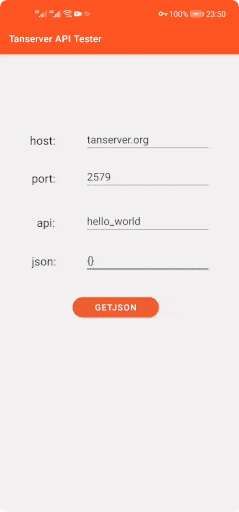

## First API

Send `hello, world` to the client.

## Create a `.py` file

Create `hello.py` in `/usr/local/tanserver/user_api/` directory.

## API: hello_world

```python linenums="1"
# hello.py

from tanserver import *

def hello_world(json_obj):
    return 'hello, world'
```

!!! note
    Run `sudo /etc/init.d/tanserver reload` to reload APIs.

## Access the API

Since Tanserver uses a custom protocol, you need to access the API through a client connector (currently supports [Java](./java.md) / [Swift](./swift.md) / [JavaScript](./javascript.md)).

!!! info
    You can also test your APIs through our [API tester](./api-tester/tester.md).

Client code:

=== "Java"

    ```java linenums="1"
    import tan.Tanserver;

    /* Initialize connection information.  */
    Tanserver tan = new Tanserver("tanserver.org", 2579);

    /* The first parameter of getJSON() specifies the API name.  */
    tan.getJSON("hello_world", "{}", new Tanserver.Callback() {

        @Override
        public void onSuccess(String jsonString) {
            /* hello, world  */
            System.out.println(jsonString);
        }

        @Override
        public void onFailure(IOException err) {
            /* An error has occurred, notify the user of network failure.  */
            System.out.println("ERROR! " + err.getMessage());
        }
    });
    ```

=== "Swift"

    ```swift linenums="1"
    /* Initialize connection information.  */
    let tan = Tanserver(host: "tanserver.org", port: 2579)

    /* The first parameter of getJSON() specifies the API name.  */
    tan.getJSON(userApi: "hello_world",
                jsonString: "{}",
                completion: { jsonData, err in

       if err != nil {
           print(err)  /* An error has occurred, notify the user of network failure.  */
           return
        }

        /* hello, world  */
        print(String(data: jsonData!, encoding: .utf8))
    })
    ```

=== "JavaScript"

    ```javascript linenums="1"
    <script src="./tanserver.js"></script>
    <script defer>
        /* Initialize connection information.  */
        var tan = new Tanserver("tanserver.org", 2579);

        /* The first parameter of getJSON() specifies the API name.  */
        tan.getJSON('hello_world', '{}', function(jsonData, err) {
            if (err != null) {
                alert(err);  /* An error has occurred, notify the   user of network failure.  */
                return;
            }
            
            /* hello, world  */
            alert(jsonData);
        });
    </script>
    ```


