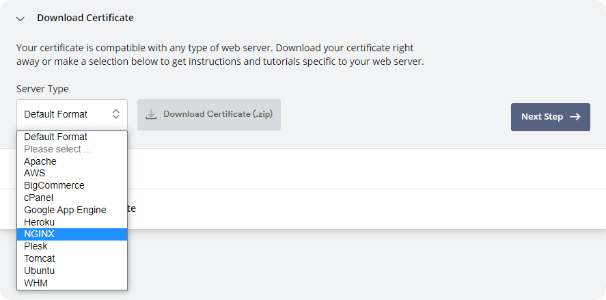

## Get a free SSL certificate

[ZeroSSL](https://help.zerossl.com/hc/en-us/articles/360060119373-Creating-an-SSL-Certificate) - Before requesting an SSL certificate, you should have a domain name.

!!! note
    The domain name used to request the SSL certificate should resolve in your server IP address.

## Download certificate

Select `NGINX` and download the certificate.



## Merge certificate

Merge `certificate.crt` and `ca_bundle.crt` into a single `certificate.crt` file, like:

``` linenums="1"
-----BEGIN CERTIFICATE-----
...
-----END CERTIFICATE-----
-----BEGIN CERTIFICATE-----
...
-----END CERTIFICATE-----
```

## Install certificate

1. Upload `certificate.crt` and `private.key` to your Linux server.

2. Edit configuration file: `/etc/tanserver.conf`.

3. Change `ssl_cert_file = your certificate`, `ssl_key_file = your private key`.

!!! warning
    Do not use a self-signed certificate.
